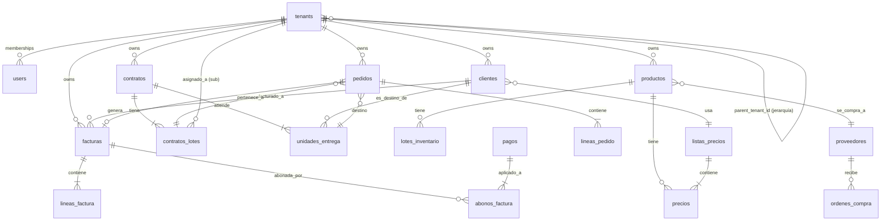

# 01 — Modelo de datos

> PostgreSQL 16 con Row-Level Security. Multi-tenant jerárquico (un tenant principal puede tener sub-tenants). Diseñado específicamente para la cadena de suministro gobierno-alimentos.

## Diagrama (Mermaid)



## Convenciones

- **PKs:** UUID v4 (`gen_random_uuid()`).
- **Tenant isolation:** toda tabla operativa lleva `tenant_id UUID NOT NULL` + RLS policy.
- **Soft-delete:** `deleted_at TIMESTAMPTZ` en tablas con datos importantes.
- **Audit:** `created_at`, `created_by`, `updated_at`, `updated_by`. Cambios mayores en `events_log`.
- **Custom fields:** `JSONB` en `clientes`, `productos`, `pedidos`, `facturas`. Permite extender sin migraciones.
- **Money:** `NUMERIC(18,4)` siempre. Nunca `FLOAT`.
- **Timestamps:** `TIMESTAMPTZ` siempre. Hora de México deriva en frontend.

---

## Dominio 1 — Multi-tenancy y auth

### `tenants`

```sql
CREATE TYPE tenant_tier AS ENUM ('PRINCIPAL', 'SUB', 'SUB_SUB');
CREATE TYPE tenant_status AS ENUM ('ACTIVE', 'TRIAL', 'SUSPENDED', 'CHURNED');

CREATE TABLE tenants (
  id                  UUID PRIMARY KEY DEFAULT gen_random_uuid(),
  parent_tenant_id    UUID REFERENCES tenants(id),  -- principal de un sub
  tier                tenant_tier NOT NULL,         -- PRINCIPAL/SUB/SUB_SUB
  status              tenant_status NOT NULL DEFAULT 'TRIAL',
  slug                VARCHAR(50) UNIQUE NOT NULL,  -- frutas-kelly, ehmo, chaneques
  legal_name          VARCHAR(254) NOT NULL,        -- razón social fiscal
  trade_name          VARCHAR(254),
  rfc                 VARCHAR(15) NOT NULL UNIQUE,
  regimen_fiscal_sat  VARCHAR(4) NOT NULL,          -- catálogo SAT c_RegimenFiscal
  domicilio_fiscal_cp VARCHAR(5) NOT NULL,
  domicilio_fiscal    JSONB NOT NULL,               -- calle, num, colonia, etc.

  -- Configuración por tenant
  config              JSONB DEFAULT '{}'::jsonb,    -- preferencias UI, integraciones, etc.

  -- Plan / billing
  plan                VARCHAR(50) DEFAULT 'trial',
  seats_limit         INT DEFAULT 3,
  trial_ends_at       TIMESTAMPTZ,

  created_at          TIMESTAMPTZ NOT NULL DEFAULT NOW(),
  updated_at          TIMESTAMPTZ NOT NULL DEFAULT NOW(),
  deleted_at          TIMESTAMPTZ
);

CREATE INDEX idx_tenants_parent ON tenants(parent_tenant_id) WHERE parent_tenant_id IS NOT NULL;
CREATE INDEX idx_tenants_status ON tenants(status) WHERE deleted_at IS NULL;
```

**Notas:**
- `tier=PRINCIPAL` ve a sus subs vía `parent_tenant_id`. Tenant SUB ve solo lo suyo.
- Frutas Kelly empieza como `tier=SUB`, `parent_tenant_id=NULL` (no tiene principal en el sistema todavía). Cuando EHMO entre como `tier=PRINCIPAL`, podrá invitar a Frutas Kelly como su sub.

### `users`

```sql
CREATE TABLE users (
  id              UUID PRIMARY KEY DEFAULT gen_random_uuid(),
  email           VARCHAR(254) UNIQUE NOT NULL,
  full_name       VARCHAR(254),
  phone           VARCHAR(20),
  auth_provider   VARCHAR(20) DEFAULT 'supabase',
  auth_user_id    VARCHAR(254),  -- Supabase Auth user id
  created_at      TIMESTAMPTZ DEFAULT NOW()
);
```

### `memberships` (user × tenant + rol)

```sql
CREATE TYPE user_role AS ENUM ('OWNER', 'ADMIN', 'OPERATOR', 'VIEWER');

CREATE TABLE memberships (
  id              UUID PRIMARY KEY DEFAULT gen_random_uuid(),
  tenant_id       UUID NOT NULL REFERENCES tenants(id),
  user_id         UUID NOT NULL REFERENCES users(id),
  role            user_role NOT NULL,
  active          BOOLEAN DEFAULT TRUE,
  created_at      TIMESTAMPTZ DEFAULT NOW(),
  UNIQUE (tenant_id, user_id)
);
```

---

## Dominio 2 — Catálogos SAT (sincronizados)

### `sat_productos_servicios`, `sat_unidades`, `sat_regimenes`, `sat_usos_cfdi`, `sat_formas_pago`, `sat_metodos_pago`, `sat_codigos_postales`

Tablas globales (sin `tenant_id`) que se sincronizan diariamente desde el SAT. Solo lectura para tenants. Código del bootstrap llena estas desde los archivos de `kelly_saas/docs/config/` y los catálogos públicos del SAT.

```sql
CREATE TABLE sat_productos_servicios (
  clave           VARCHAR(8) PRIMARY KEY,           -- ej. "50202301"
  descripcion     TEXT NOT NULL,
  categoria       VARCHAR(8),
  vigencia_desde  DATE,
  vigencia_hasta  DATE
);

CREATE TABLE sat_unidades (
  clave           VARCHAR(3) PRIMARY KEY,           -- ej. "KGM", "H87"
  nombre          VARCHAR(100) NOT NULL,
  descripcion     TEXT,
  simbolo         VARCHAR(10)
);

-- patrón similar para sat_regimenes, sat_usos_cfdi, sat_formas_pago, sat_metodos_pago, sat_codigos_postales
```

---

## Dominio 3 — Contratos y unidades

> **Aquí está la diferencia con un ERP genérico.** Un contrato gubernamental se compone de uno o varios lotes (categorías), cada uno se asigna a un sub. Las unidades de entrega están atadas al contrato, no al cliente.

### `contratos`

```sql
CREATE TABLE contratos (
  id                  UUID PRIMARY KEY DEFAULT gen_random_uuid(),
  tenant_id           UUID NOT NULL REFERENCES tenants(id),  -- el principal o el sub
  numero_contrato     VARCHAR(50),                          -- número oficial gov si lo tienen
  contratante         VARCHAR(254) NOT NULL,                -- "SEDENA", "IMSS-Bienestar Chiapas", etc.
  contratante_rfc     VARCHAR(15),                          -- si aplica
  estado_mx           VARCHAR(50),                          -- estado mexicano principal
  vigencia_desde      DATE NOT NULL,
  vigencia_hasta      DATE NOT NULL,
  monto_max           NUMERIC(18,4),
  condiciones_pago    VARCHAR(50),                          -- "30 días", "PPD a 60", etc.
  notas               TEXT,
  config              JSONB DEFAULT '{}'::jsonb,            -- info específica del contrato

  created_at          TIMESTAMPTZ DEFAULT NOW(),
  updated_at          TIMESTAMPTZ DEFAULT NOW(),
  deleted_at          TIMESTAMPTZ
);

CREATE INDEX idx_contratos_tenant ON contratos(tenant_id) WHERE deleted_at IS NULL;
```

### `contratos_lotes`

```sql
CREATE TABLE contratos_lotes (
  id                  UUID PRIMARY KEY DEFAULT gen_random_uuid(),
  contrato_id         UUID NOT NULL REFERENCES contratos(id) ON DELETE CASCADE,
  numero_lote         INT NOT NULL,                         -- 1=Abarrotes, 5=FyV, etc.
  descripcion         VARCHAR(254) NOT NULL,                -- "Lote 5 — Frutas y Verduras"
  asignado_a_tenant   UUID REFERENCES tenants(id),          -- el sub que surte este lote
  lista_precios_id    UUID REFERENCES listas_precios(id),   -- precios pactados para este lote
  monto_lote          NUMERIC(18,4),

  created_at          TIMESTAMPTZ DEFAULT NOW(),
  UNIQUE (contrato_id, numero_lote)
);
```

**Nota crítica:** un lote puede estar asignado a un tenant distinto del owner del contrato. Ejemplo: contrato es de EHMO (`tenant_id=ehmo_uuid`), lote 5 está `asignado_a_tenant=frutas_kelly_uuid`. RLS permite que ambos lo vean según su rol.

### `unidades_entrega`

```sql
CREATE TYPE unidad_tipo AS ENUM ('HOSPITAL', 'COMEDOR', 'ESCUELA', 'MILITAR', 'RECLUSORIO', 'ALMACEN', 'OTRO');

CREATE TABLE unidades_entrega (
  id                  UUID PRIMARY KEY DEFAULT gen_random_uuid(),
  contrato_id         UUID NOT NULL REFERENCES contratos(id),
  codigo              VARCHAR(50),                          -- código interno del contrato
  nombre              VARCHAR(254) NOT NULL,                -- "Hospital Básico Comunitario Chiapa de Corzo"
  tipo                unidad_tipo NOT NULL,
  ciudad              VARCHAR(100),
  estado_mx           VARCHAR(50),
  direccion           TEXT,
  cp                  VARCHAR(5),
  contacto_nombre     VARCHAR(254),
  contacto_telefono   VARCHAR(20),
  contacto_email      VARCHAR(254),
  geolocation         POINT,                                -- lat/lon

  -- Frecuencia y protocolo
  frecuencia_entrega  VARCHAR(50),                          -- "diaria", "L-X-V", "M-J", etc.
  hora_corte_pedido   TIME,                                 -- pedido se cierra a las X
  hora_entrega        TIME,                                 -- entrega típica
  protocolo           JSONB DEFAULT '{}'::jsonb,            -- formato esperado, contactos, observaciones

  -- Estado
  activa              BOOLEAN DEFAULT TRUE,
  notas               TEXT,

  created_at          TIMESTAMPTZ DEFAULT NOW(),
  updated_at          TIMESTAMPTZ DEFAULT NOW(),
  deleted_at          TIMESTAMPTZ
);

CREATE INDEX idx_unidades_contrato ON unidades_entrega(contrato_id) WHERE deleted_at IS NULL;
```

---

## Dominio 4 — Clientes (CRM con datos fiscales)

> En el modelo de gobierno, **el cliente de facturación es el principal** (a quien le facturas), no la unidad. Eso lo distingue de retail B2B.

### `clientes`

```sql
CREATE TYPE cliente_tipo AS ENUM ('PRINCIPAL_GOV', 'SUB', 'PRIVADO', 'OTRO');

CREATE TABLE clientes (
  id                  UUID PRIMARY KEY DEFAULT gen_random_uuid(),
  tenant_id           UUID NOT NULL REFERENCES tenants(id),
  codigo              VARCHAR(20),                           -- legible, ej. "EHMO", "CHANEQUES"
  tipo                cliente_tipo NOT NULL,
  status              VARCHAR(20) DEFAULT 'ACTIVO',          -- ACTIVO, SUSPENDIDO, MOROSO

  -- Fiscales
  legal_name          VARCHAR(254) NOT NULL,
  rfc                 VARCHAR(15) NOT NULL,
  regimen_fiscal      VARCHAR(4),                            -- FK lógica → sat_regimenes
  uso_cfdi_default    VARCHAR(5),                            -- FK lógica → sat_usos_cfdi
  forma_pago_default  VARCHAR(5),                            -- FK lógica → sat_formas_pago
  metodo_pago_default VARCHAR(5),                            -- PUE/PPD
  domicilio_fiscal    JSONB NOT NULL,                        -- calle, num, colonia, cp, etc.

  -- Comerciales
  lista_precios_id    UUID REFERENCES listas_precios(id),
  condiciones_pago    VARCHAR(50),                           -- "30 días", "Contado"
  limite_credito      NUMERIC(18,4) DEFAULT 0,
  dias_credito        INT DEFAULT 0,
  descuento_default   NUMERIC(5,2) DEFAULT 0,

  -- Addenda específica (Walmart, Soriana, hospitales DIF, etc.)
  config_addenda      JSONB DEFAULT '{}'::jsonb,             -- {"tipo": "walmart_v2", "datos": {...}}

  -- Acumulados (denormalizados, refrescables)
  saldo_actual        NUMERIC(18,4) DEFAULT 0,
  ventas_ytd          NUMERIC(18,4) DEFAULT 0,
  ultima_venta_at     TIMESTAMPTZ,
  ultimo_pago_at      TIMESTAMPTZ,

  custom_fields       JSONB DEFAULT '{}'::jsonb,

  created_at          TIMESTAMPTZ DEFAULT NOW(),
  updated_at          TIMESTAMPTZ DEFAULT NOW(),
  deleted_at          TIMESTAMPTZ,

  UNIQUE (tenant_id, codigo)
);

CREATE INDEX idx_clientes_tenant_status ON clientes(tenant_id, status) WHERE deleted_at IS NULL;
CREATE INDEX idx_clientes_rfc ON clientes(rfc);
CREATE INDEX idx_clientes_search ON clientes USING gin(to_tsvector('spanish', legal_name));
```

---

## Dominio 5 — Productos y precios

### `productos`

```sql
CREATE TABLE productos (
  id                      UUID PRIMARY KEY DEFAULT gen_random_uuid(),
  tenant_id               UUID NOT NULL REFERENCES tenants(id),
  sku_interno             VARCHAR(50) NOT NULL,
  nombre                  VARCHAR(254) NOT NULL,             -- "Mango Ataulfo"
  nombre_normalizado      VARCHAR(254),                      -- lowercase + sin acentos para match
  descripcion             TEXT,
  categoria               VARCHAR(100),                      -- "Fruta", "Verdura", "Hortaliza"
  lote_default            INT DEFAULT 5,                     -- 1,5 según el contrato gov

  -- SAT (obligatorio para CFDI)
  clave_sat               VARCHAR(8) NOT NULL,               -- → sat_productos_servicios
  unidad_sat              VARCHAR(3) NOT NULL,               -- → sat_unidades (KGM, H87)
  objeto_imp              VARCHAR(2) DEFAULT '02',           -- 02=Sí objeto IVA
  iva_tasa                NUMERIC(5,4) DEFAULT 0,            -- 0.0 (FyV exenta), 0.16, 0.08
  ieps_tasa               NUMERIC(5,4) DEFAULT 0,

  -- Presentaciones (un producto se vende en varias unidades)
  -- Ejemplo: { "KILO": 1, "BULTO_25K": 25, "CAJA_10K": 10 }
  presentaciones          JSONB DEFAULT '{"KILO": 1}'::jsonb,
  presentacion_default    VARCHAR(20) DEFAULT 'KILO',

  -- Sinónimos / aliases (para que el AI matchee distintos nombres)
  sinonimos               TEXT[],                             -- ["mango", "ataulfo grande"]
  aliases_clientes        JSONB DEFAULT '{}'::jsonb,          -- {"<cliente_id>": "Mango grande KG"}

  -- Costeo (denormalizado)
  costo_promedio          NUMERIC(18,4) DEFAULT 0,

  -- Estado
  activo                  BOOLEAN DEFAULT TRUE,
  custom_fields           JSONB DEFAULT '{}'::jsonb,

  created_at              TIMESTAMPTZ DEFAULT NOW(),
  updated_at              TIMESTAMPTZ DEFAULT NOW(),
  deleted_at              TIMESTAMPTZ,

  UNIQUE (tenant_id, sku_interno)
);

CREATE INDEX idx_productos_tenant ON productos(tenant_id) WHERE deleted_at IS NULL AND activo = TRUE;
CREATE INDEX idx_productos_search ON productos USING gin(to_tsvector('spanish', nombre || ' ' || COALESCE(descripcion,'')));
CREATE INDEX idx_productos_normalizado ON productos(tenant_id, nombre_normalizado);
```

### `listas_precios` y `precios`

```sql
CREATE TABLE listas_precios (
  id              UUID PRIMARY KEY DEFAULT gen_random_uuid(),
  tenant_id       UUID NOT NULL REFERENCES tenants(id),
  codigo          VARCHAR(20) NOT NULL,                       -- "EHMO", "SURENA", "PUBLICA"
  nombre          VARCHAR(254) NOT NULL,
  vigencia_desde  DATE,
  vigencia_hasta  DATE,
  moneda          VARCHAR(3) DEFAULT 'MXN',
  notas           TEXT,
  created_at      TIMESTAMPTZ DEFAULT NOW(),
  UNIQUE (tenant_id, codigo)
);

CREATE TABLE precios (
  id              UUID PRIMARY KEY DEFAULT gen_random_uuid(),
  lista_id        UUID NOT NULL REFERENCES listas_precios(id) ON DELETE CASCADE,
  producto_id     UUID NOT NULL REFERENCES productos(id),
  presentacion    VARCHAR(20) NOT NULL DEFAULT 'KILO',         -- referencia a productos.presentaciones
  precio_unitario NUMERIC(18,4) NOT NULL CHECK (precio_unitario >= 0),
  vigencia_desde  DATE,
  vigencia_hasta  DATE,

  UNIQUE (lista_id, producto_id, presentacion, vigencia_desde)
);

CREATE INDEX idx_precios_lookup ON precios(lista_id, producto_id);
```

---

## Dominio 6 — Inventario y lotes (FEFO crítico)

### `almacenes`

```sql
CREATE TABLE almacenes (
  id              UUID PRIMARY KEY DEFAULT gen_random_uuid(),
  tenant_id       UUID NOT NULL REFERENCES tenants(id),
  codigo          VARCHAR(20) NOT NULL,
  nombre          VARCHAR(254) NOT NULL,
  direccion       TEXT,
  es_default      BOOLEAN DEFAULT FALSE,
  created_at      TIMESTAMPTZ DEFAULT NOW(),
  UNIQUE (tenant_id, codigo)
);
```

### `lotes_inventario`

```sql
CREATE TABLE lotes_inventario (
  id                  UUID PRIMARY KEY DEFAULT gen_random_uuid(),
  tenant_id           UUID NOT NULL REFERENCES tenants(id),
  producto_id         UUID NOT NULL REFERENCES productos(id),
  almacen_id          UUID NOT NULL REFERENCES almacenes(id),
  numero_lote         VARCHAR(50),                            -- código del lote/proveedor
  fecha_ingreso       DATE NOT NULL,
  fecha_caducidad     DATE,                                   -- crítico para FEFO
  cantidad_inicial    NUMERIC(18,4) NOT NULL,
  cantidad_disponible NUMERIC(18,4) NOT NULL CHECK (cantidad_disponible >= 0),
  costo_unitario      NUMERIC(18,4) NOT NULL,
  proveedor_id        UUID REFERENCES proveedores(id),
  notas               TEXT,

  created_at          TIMESTAMPTZ DEFAULT NOW(),
  updated_at          TIMESTAMPTZ DEFAULT NOW()
);

CREATE INDEX idx_lotes_fefo ON lotes_inventario(tenant_id, producto_id, fecha_caducidad)
  WHERE cantidad_disponible > 0;
```

### `movimientos_inventario`

```sql
CREATE TYPE movimiento_tipo AS ENUM ('ENTRADA', 'SALIDA', 'AJUSTE', 'MERMA', 'TRANSFERENCIA');

CREATE TABLE movimientos_inventario (
  id                  UUID PRIMARY KEY DEFAULT gen_random_uuid(),
  tenant_id           UUID NOT NULL REFERENCES tenants(id),
  tipo                movimiento_tipo NOT NULL,
  fecha               TIMESTAMPTZ NOT NULL DEFAULT NOW(),
  lote_id             UUID NOT NULL REFERENCES lotes_inventario(id),
  cantidad            NUMERIC(18,4) NOT NULL,                  -- + entrada, - salida
  costo_unitario      NUMERIC(18,4),
  ref_tipo            VARCHAR(20),                              -- 'PEDIDO', 'COMPRA', 'AJUSTE', 'MERMA'
  ref_id              UUID,                                     -- id del documento origen
  motivo              VARCHAR(254),
  notas               TEXT,
  created_by          UUID REFERENCES users(id),
  created_at          TIMESTAMPTZ DEFAULT NOW()
);

CREATE INDEX idx_mov_inv_lote ON movimientos_inventario(lote_id);
CREATE INDEX idx_mov_inv_ref ON movimientos_inventario(ref_tipo, ref_id);
```

### `mermas`

```sql
CREATE TYPE merma_motivo AS ENUM ('CADUCIDAD', 'CALIDAD', 'DEVOLUCION_CLIENTE', 'ROBO', 'DESCOMPOSICION', 'OTRO');

CREATE TABLE mermas (
  id              UUID PRIMARY KEY DEFAULT gen_random_uuid(),
  tenant_id       UUID NOT NULL REFERENCES tenants(id),
  fecha           DATE NOT NULL,
  lote_id         UUID NOT NULL REFERENCES lotes_inventario(id),
  cantidad        NUMERIC(18,4) NOT NULL,
  motivo          merma_motivo NOT NULL,
  descripcion     TEXT,
  factura_id      UUID REFERENCES facturas(id),               -- nota de crédito si aplica
  evidencia_url   TEXT,                                        -- foto/documento
  created_by      UUID REFERENCES users(id),
  created_at      TIMESTAMPTZ DEFAULT NOW()
);
```

---

## Dominio 7 — Pedidos (corazón operativo)

### `pedidos`

```sql
CREATE TYPE pedido_estado AS ENUM (
  'BORRADOR',         -- en captura/edición
  'CONFIRMADO',       -- listo para surtir
  'EN_SURTIDO',       -- preparándose en almacén
  'ENVIADO',          -- en camino
  'ENTREGADO',        -- acuse OK
  'FACTURADO',        -- CFDI emitido
  'CANCELADO'
);

CREATE TYPE canal_origen AS ENUM ('WHATSAPP', 'EMAIL', 'EXCEL_BD', 'LIBRETA_FOTO', 'VOZ', 'WEB', 'API', 'MANUAL');

CREATE TABLE pedidos (
  id                  UUID PRIMARY KEY DEFAULT gen_random_uuid(),
  tenant_id           UUID NOT NULL REFERENCES tenants(id),
  folio_interno       VARCHAR(20),                              -- contador autoincremental por tenant
  contrato_lote_id    UUID REFERENCES contratos_lotes(id),      -- a qué contrato/lote pertenece
  cliente_facturacion_id UUID NOT NULL REFERENCES clientes(id), -- a quién se factura (el principal)
  unidad_entrega_id   UUID REFERENCES unidades_entrega(id),     -- dónde se entrega

  fecha_pedido        DATE NOT NULL,
  fecha_entrega       DATE,
  estado              pedido_estado NOT NULL DEFAULT 'BORRADOR',

  -- Origen
  canal               canal_origen NOT NULL,
  raw_message_id      UUID REFERENCES mensajes_log(id),         -- mensaje de WhatsApp/email original
  raw_payload         JSONB,                                     -- copia del mensaje/email para debugging

  -- Totales (denormalizados desde lineas_pedido)
  subtotal            NUMERIC(18,4) DEFAULT 0,
  descuento           NUMERIC(18,4) DEFAULT 0,
  iva                 NUMERIC(18,4) DEFAULT 0,
  total               NUMERIC(18,4) DEFAULT 0,

  -- AI metadata
  ai_confidence       NUMERIC(5,4),                              -- 0.0-1.0 confianza AI en parsing
  ai_warnings         JSONB DEFAULT '[]'::jsonb,                 -- ["unidad no reconocida", ...]
  requires_review     BOOLEAN DEFAULT FALSE,                     -- excepción para human review

  notas               TEXT,
  custom_fields       JSONB DEFAULT '{}'::jsonb,

  created_at          TIMESTAMPTZ DEFAULT NOW(),
  created_by          UUID REFERENCES users(id),
  updated_at          TIMESTAMPTZ DEFAULT NOW(),
  updated_by          UUID REFERENCES users(id),
  deleted_at          TIMESTAMPTZ
);

CREATE INDEX idx_pedidos_tenant_fecha ON pedidos(tenant_id, fecha_pedido DESC) WHERE deleted_at IS NULL;
CREATE INDEX idx_pedidos_estado ON pedidos(tenant_id, estado) WHERE deleted_at IS NULL;
CREATE INDEX idx_pedidos_review ON pedidos(tenant_id) WHERE requires_review = TRUE;
CREATE INDEX idx_pedidos_unidad ON pedidos(unidad_entrega_id, fecha_pedido DESC);
```

### `lineas_pedido`

```sql
CREATE TABLE lineas_pedido (
  id                  UUID PRIMARY KEY DEFAULT gen_random_uuid(),
  pedido_id           UUID NOT NULL REFERENCES pedidos(id) ON DELETE CASCADE,
  numero_linea        SMALLINT NOT NULL,
  producto_id         UUID REFERENCES productos(id),            -- NULL si AI no pudo matchear
  presentacion        VARCHAR(20) NOT NULL DEFAULT 'KILO',
  cantidad_solicitada NUMERIC(18,4) NOT NULL,
  cantidad_surtida    NUMERIC(18,4),                            -- puede diferir (mermas, faltantes)
  precio_unitario     NUMERIC(18,4) NOT NULL,
  importe             NUMERIC(18,4) NOT NULL,

  -- Lote asignado al surtir (FEFO)
  lote_id             UUID REFERENCES lotes_inventario(id),

  -- AI metadata
  texto_original      TEXT,                                      -- "2 kg manguito chido" lo que dijo el cliente
  ai_match_confidence NUMERIC(5,4),                              -- 0.0-1.0

  notas               TEXT,
  UNIQUE (pedido_id, numero_linea)
);
```

---

## Dominio 8 — Facturación (CFDI 4.0)

### `csds` (certificados de sello digital)

```sql
CREATE TABLE csds (
  id              UUID PRIMARY KEY DEFAULT gen_random_uuid(),
  tenant_id       UUID NOT NULL REFERENCES tenants(id),
  numero_serie    VARCHAR(20) NOT NULL UNIQUE,
  vigencia_desde  DATE,
  vigencia_hasta  DATE,
  -- Los archivos .key/.cer cifrados se guardan en Supabase Storage
  storage_path    TEXT NOT NULL,                                -- ruta cifrada
  password_kms_id TEXT NOT NULL,                                -- key id en KMS
  activo          BOOLEAN DEFAULT TRUE,
  created_at      TIMESTAMPTZ DEFAULT NOW()
);
```

### `facturas`

```sql
CREATE TYPE factura_tipo AS ENUM ('INGRESO', 'EGRESO', 'TRASLADO', 'NOMINA', 'PAGO');
CREATE TYPE factura_estado AS ENUM ('BORRADOR', 'TIMBRADA', 'CANCELADA', 'ERROR_TIMBRADO');

CREATE TABLE facturas (
  id                  UUID PRIMARY KEY DEFAULT gen_random_uuid(),
  tenant_id           UUID NOT NULL REFERENCES tenants(id),
  serie               VARCHAR(10) NOT NULL,
  folio               BIGINT NOT NULL,
  tipo                factura_tipo NOT NULL DEFAULT 'INGRESO',
  estado              factura_estado NOT NULL DEFAULT 'BORRADOR',

  -- Relación a pedido
  pedido_id           UUID REFERENCES pedidos(id),
  cliente_id          UUID NOT NULL REFERENCES clientes(id),

  -- Datos fiscales (snapshot al momento de timbrar — no FK a vivo)
  receptor_rfc        VARCHAR(15) NOT NULL,
  receptor_nombre     VARCHAR(254) NOT NULL,
  receptor_regimen    VARCHAR(4) NOT NULL,
  receptor_uso_cfdi   VARCHAR(5) NOT NULL,
  receptor_cp         VARCHAR(5) NOT NULL,

  -- Pago
  forma_pago          VARCHAR(5),
  metodo_pago         VARCHAR(5) NOT NULL,                       -- PUE/PPD
  moneda              VARCHAR(3) DEFAULT 'MXN',
  tipo_cambio         NUMERIC(10,6) DEFAULT 1,
  condiciones_pago    VARCHAR(50),

  -- Totales
  subtotal            NUMERIC(18,4) NOT NULL,
  descuento           NUMERIC(18,4) DEFAULT 0,
  iva_trasladado      NUMERIC(18,4) DEFAULT 0,
  iva_retenido        NUMERIC(18,4) DEFAULT 0,
  isr_retenido        NUMERIC(18,4) DEFAULT 0,
  total               NUMERIC(18,4) NOT NULL,

  -- CFDI
  uuid_sat            UUID UNIQUE,                                -- folio fiscal del SAT
  fecha_timbrado      TIMESTAMPTZ,
  pac                 VARCHAR(50),                                -- "facturama"
  xml_storage_path    TEXT,                                        -- Supabase Storage
  pdf_storage_path    TEXT,
  certificado_sat     VARCHAR(20),                                 -- numero serie SAT

  -- Cancelación
  fecha_cancelacion   TIMESTAMPTZ,
  motivo_cancelacion  VARCHAR(2),                                  -- 01,02,03,04
  uuid_sustitucion    UUID,
  acuse_cancelacion   JSONB,

  -- Addenda usada (snapshot)
  addenda_xml         TEXT,

  custom_fields       JSONB DEFAULT '{}'::jsonb,

  created_at          TIMESTAMPTZ DEFAULT NOW(),
  created_by          UUID REFERENCES users(id),
  updated_at          TIMESTAMPTZ DEFAULT NOW(),
  deleted_at          TIMESTAMPTZ,

  UNIQUE (tenant_id, serie, folio, tipo)
);

CREATE INDEX idx_facturas_tenant_fecha ON facturas(tenant_id, created_at DESC);
CREATE INDEX idx_facturas_uuid ON facturas(uuid_sat);
CREATE INDEX idx_facturas_cliente ON facturas(cliente_id, created_at DESC);
```

### `lineas_factura`

```sql
CREATE TABLE lineas_factura (
  id                  UUID PRIMARY KEY DEFAULT gen_random_uuid(),
  factura_id          UUID NOT NULL REFERENCES facturas(id) ON DELETE CASCADE,
  linea_pedido_id     UUID REFERENCES lineas_pedido(id),
  numero_linea        SMALLINT NOT NULL,

  -- Snapshot del producto al momento de facturar
  producto_id         UUID REFERENCES productos(id),
  clave_sat           VARCHAR(8) NOT NULL,
  unidad_sat          VARCHAR(3) NOT NULL,
  objeto_imp          VARCHAR(2) NOT NULL,
  descripcion         TEXT NOT NULL,

  cantidad            NUMERIC(18,6) NOT NULL,
  unidad_descripcion  VARCHAR(50),                                -- "KILO", "BULTO 25KG"
  precio_unitario     NUMERIC(18,6) NOT NULL,
  subtotal            NUMERIC(18,4) NOT NULL,
  descuento           NUMERIC(18,4) DEFAULT 0,
  iva_tasa            NUMERIC(5,4) DEFAULT 0,
  iva_importe         NUMERIC(18,4) DEFAULT 0,
  total_linea         NUMERIC(18,4) NOT NULL,

  UNIQUE (factura_id, numero_linea)
);
```

---

## Dominio 9 — Pagos (CXC)

### `pagos`

```sql
CREATE TABLE pagos (
  id                  UUID PRIMARY KEY DEFAULT gen_random_uuid(),
  tenant_id           UUID NOT NULL REFERENCES tenants(id),
  cliente_id          UUID NOT NULL REFERENCES clientes(id),
  fecha               DATE NOT NULL,
  monto               NUMERIC(18,4) NOT NULL,
  forma_pago          VARCHAR(5) NOT NULL,                        -- 01=Efectivo, 03=Transferencia, etc.
  banco               VARCHAR(100),
  referencia          VARCHAR(100),                                -- num cheque, ref bancaria, etc.

  -- CFDI complemento de pago
  factura_pago_id     UUID REFERENCES facturas(id),               -- factura tipo PAGO generada
  uuid_complemento    UUID,

  notas               TEXT,
  created_at          TIMESTAMPTZ DEFAULT NOW(),
  created_by          UUID REFERENCES users(id)
);
```

### `abonos_factura` (relación N:N)

```sql
CREATE TABLE abonos_factura (
  id              UUID PRIMARY KEY DEFAULT gen_random_uuid(),
  pago_id         UUID NOT NULL REFERENCES pagos(id),
  factura_id      UUID NOT NULL REFERENCES facturas(id),
  monto           NUMERIC(18,4) NOT NULL CHECK (monto > 0),
  numero_parcialidad INT NOT NULL DEFAULT 1,                       -- para PPD

  UNIQUE (pago_id, factura_id, numero_parcialidad)
);

CREATE INDEX idx_abonos_factura ON abonos_factura(factura_id);
CREATE INDEX idx_abonos_pago ON abonos_factura(pago_id);
```

---

## Dominio 10 — Proveedores y subcontratación (los 30 sub-sub)

### `proveedores`

```sql
CREATE TABLE proveedores (
  id              UUID PRIMARY KEY DEFAULT gen_random_uuid(),
  tenant_id       UUID NOT NULL REFERENCES tenants(id),
  codigo          VARCHAR(20) NOT NULL,
  nombre          VARCHAR(254) NOT NULL,
  rfc             VARCHAR(15),
  contacto        VARCHAR(254),
  telefono        VARCHAR(20),
  email           VARCHAR(254),

  -- Categorías que provee (carne, pan, tortilla, congelados, etc.)
  categorias      TEXT[],

  -- Es sub-sub-proveedor para qué lotes/contratos
  contratos_lotes_atendidos UUID[],

  condiciones_pago VARCHAR(50),
  activo          BOOLEAN DEFAULT TRUE,
  notas           TEXT,
  created_at      TIMESTAMPTZ DEFAULT NOW(),
  UNIQUE (tenant_id, codigo)
);
```

### `ordenes_compra` (al sub-sub-proveedor)

```sql
CREATE TYPE oc_estado AS ENUM ('BORRADOR', 'ENVIADA', 'ACEPTADA', 'EN_TRANSITO', 'RECIBIDA', 'CANCELADA');

CREATE TABLE ordenes_compra (
  id                  UUID PRIMARY KEY DEFAULT gen_random_uuid(),
  tenant_id           UUID NOT NULL REFERENCES tenants(id),
  folio               VARCHAR(20),
  proveedor_id        UUID NOT NULL REFERENCES proveedores(id),
  pedido_origen_id    UUID REFERENCES pedidos(id),                 -- pedido del cliente que origina esta OC
  fecha               DATE NOT NULL,
  estado              oc_estado DEFAULT 'BORRADOR',
  total_estimado      NUMERIC(18,4),
  notas               TEXT,
  created_at          TIMESTAMPTZ DEFAULT NOW()
);

-- (lineas_orden_compra omitidas por brevedad — patrón análogo a lineas_pedido)
```

---

## Dominio 11 — Audit y observabilidad

### `events_log`

```sql
CREATE TABLE events_log (
  id              BIGSERIAL PRIMARY KEY,
  tenant_id       UUID NOT NULL,
  user_id         UUID,
  event_type      VARCHAR(100) NOT NULL,                          -- "factura.timbrada", "pedido.creado"
  entity_type     VARCHAR(50) NOT NULL,
  entity_id       UUID,
  before_state    JSONB,
  after_state     JSONB,
  metadata        JSONB,
  occurred_at     TIMESTAMPTZ NOT NULL DEFAULT NOW(),
  ip_address      INET,
  user_agent      TEXT
);

CREATE INDEX idx_events_entity ON events_log(entity_type, entity_id);
CREATE INDEX idx_events_tenant_time ON events_log(tenant_id, occurred_at DESC);
```

### `mensajes_log`

```sql
CREATE TYPE mensaje_canal AS ENUM ('WHATSAPP', 'EMAIL', 'WEB', 'SMS', 'API');
CREATE TYPE mensaje_direccion AS ENUM ('IN', 'OUT');

CREATE TABLE mensajes_log (
  id              UUID PRIMARY KEY DEFAULT gen_random_uuid(),
  tenant_id       UUID NOT NULL REFERENCES tenants(id),
  canal           mensaje_canal NOT NULL,
  direccion       mensaje_direccion NOT NULL,
  contraparte     VARCHAR(254),                                   -- teléfono o email
  contenido       TEXT,
  attachments     JSONB DEFAULT '[]'::jsonb,                      -- urls a Supabase Storage
  agente_id       UUID,                                            -- referencia al agente que respondió
  metadata        JSONB DEFAULT '{}'::jsonb,                      -- whatsapp_message_id, etc.
  created_at      TIMESTAMPTZ DEFAULT NOW()
);

CREATE INDEX idx_mensajes_tenant_time ON mensajes_log(tenant_id, created_at DESC);
CREATE INDEX idx_mensajes_contraparte ON mensajes_log(tenant_id, contraparte);
```

---

## Row-Level Security (RLS) — patrón

```sql
-- Activar RLS en cada tabla con tenant_id
ALTER TABLE clientes ENABLE ROW LEVEL SECURITY;

-- Policy: el usuario ve solo su tenant + (si es PRINCIPAL) los de sus subs
CREATE POLICY tenant_isolation ON clientes
  FOR ALL
  USING (
    tenant_id = current_setting('app.current_tenant_id')::uuid
    OR tenant_id IN (
      SELECT id FROM tenants
      WHERE parent_tenant_id = current_setting('app.current_tenant_id')::uuid
    )
  );

-- Patrón se repite para todas las tablas con tenant_id
```

La aplicación setea `app.current_tenant_id` por sesión usando `SET LOCAL`.

---

## Resumen de tablas

| # | Tabla | Dominio |
|---|---|---|
| 1 | `tenants` | Tenancy |
| 2 | `users` | Auth |
| 3 | `memberships` | Auth |
| 4 | `sat_*` (6 tablas) | Catálogos SAT |
| 5 | `contratos` | Contratos |
| 6 | `contratos_lotes` | Contratos |
| 7 | `unidades_entrega` | Contratos |
| 8 | `clientes` | CRM |
| 9 | `productos` | Catálogo |
| 10 | `listas_precios` | Catálogo |
| 11 | `precios` | Catálogo |
| 12 | `almacenes` | Inventario |
| 13 | `lotes_inventario` | Inventario |
| 14 | `movimientos_inventario` | Inventario |
| 15 | `mermas` | Inventario |
| 16 | `pedidos` | Pedidos |
| 17 | `lineas_pedido` | Pedidos |
| 18 | `csds` | Facturación |
| 19 | `facturas` | Facturación |
| 20 | `lineas_factura` | Facturación |
| 21 | `pagos` | CXC |
| 22 | `abonos_factura` | CXC |
| 23 | `proveedores` | Compras |
| 24 | `ordenes_compra` (+lineas) | Compras |
| 25 | `events_log` | Observabilidad |
| 26 | `mensajes_log` | Observabilidad |

**Total: ~26 tablas operativas + 6 SAT = ~32 tablas.** Vs. SAE10 con 210, pero con FKs reales, RLS, audit log, multi-tenant nativo, y el dominio gobierno-alimentos modelado correctamente desde el día 1.

---

## Comparación con SAE10 (kelly_saas reference)

| SAE10 | Cadena de Suministro AI | Notas |
|---|---|---|
| `CLIE02` (98 cols) | `clientes` (con custom_fields JSONB) | Reducimos columnas; flexibilidad en JSONB |
| Sufijos `02`, `03` por empresa | `tenant_id` + RLS | Multi-tenant moderno |
| `LISTA_PREC` int | `lista_precios_id` UUID FK | FK real |
| `ADDENDAF`, `ADDENDAT` varchar | `config_addenda` JSONB | Schemaless, extensible |
| Sin FKs | FKs reales en todo | Integridad a nivel BD |
| `BITA02` 2 meses | `events_log` ilimitado | Audit completo |
| `INVE02` con multi-almacén | `productos` + `lotes_inventario` con FEFO | Lotes first-class para alimentos |
| 0 multi-tenant | RLS jerárquica | Network effects |

---

## Pendiente / out-of-scope v1

Estas vendrán en versiones siguientes, no las modelo ahora:

- **Carta Porte 3.1** (cuando empieces a tener flota propia)
- **Marketplaces** (MELI, Amazon — no aplica para gobierno)
- **DIOT / declaraciones** (las hace el contador externo con Contpaqi/Aspel COI)
- **Nómina** (no es parte del producto)
- **Multi-moneda** (todo MXN al inicio; estructura ya soporta)
- **Comercio exterior** (no aplica a gobierno MX)

---

## Próximo entregable

Si apruebas este modelo de datos:

1. **Migración inicial** (`docs/04-migration-plan.md`): cómo mover Frutas Kelly de JSONs/Excel a esta DB.
2. **API contract** (`docs/03-api-contract.md`): endpoints REST/tRPC que necesita el WhatsApp agent + frontend.
3. **Setup Supabase**: crear el proyecto, correr migraciones, RLS policies, seed de catálogos SAT.
